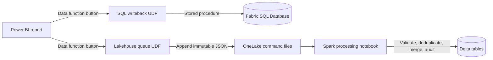

# Microsoft Fabric writeback patterns

This repository demonstrates two ways to submit employee updates from a Power BI translytical task flow by using Microsoft Fabric User Data Functions (UDFs).

| Pattern | Write path | Consistency | Recommended use |
| --- | --- | --- | --- |
| [UDF + Fabric SQL Database](docs/sql-database-pattern.md) | Power BI -> UDF -> stored procedure -> row update | Synchronous and transactional | Interactive writeback, concurrent users, and production workloads |
| [UDF + Lakehouse + Spark notebook](docs/lakehouse-pattern.md) | Power BI -> UDF -> JSON command -> Spark `MERGE` | Asynchronous and eventual | Lakehouse-first demos, queued workflows, and lower-frequency batch application |

**Default recommendation:** use Fabric SQL Database when a report user expects the submitted update to commit immediately. Use the Lakehouse pattern only when queued application and delayed visibility are acceptable.



## Repository layout

```text
fabric-items/
  EmployeeWritebackFunctions.UserDataFunction/   SQL UDF source and connection template
  EmployeeWriteback2.UserDataFunction/           Lakehouse queue UDF source and template
  Apply_Employee_Lakehouse_Writeback.Notebook/   Portable Fabric notebook source
scripts/
  sql/                                            SQL schema, sample data, and rollback test
  lakehouse/                                      Optional sample Delta source data
docs/
  sql-database-pattern.md                         SQL deployment walkthrough
  lakehouse-pattern.md                            Lakehouse deployment walkthrough
  limitations.md                                  Concurrency and service limits
  microsoft-learn.md                              First-party reference links
tests/
  validate_repo.py                                Offline source and portability checks
```

## Important portability note

The source workspace's item IDs and connection IDs are intentionally excluded. A UDF managed connection is bound to a concrete item in one workspace, and a Power BI data function button stores an explicit workspace, function set, and function reference. Create those bindings again in the destination workspace.

The `definition.example.json` files are documentation templates. Replace their placeholders if using an API-based deployment; for the simplest deployment, create each UDF in the Fabric portal, add the named connection, and paste the matching `function_app.py` source.

## Start here

1. Choose [the SQL Database pattern](docs/sql-database-pattern.md) or [the Lakehouse pattern](docs/lakehouse-pattern.md).
2. Review [concurrency and limitations](docs/limitations.md) before selecting the Lakehouse option.
3. Configure the Power BI button as **Action > Data function**. Do not use a Web URL button for this report flow.
4. Run the offline repository checks:

   ```powershell
   python tests/validate_repo.py
   ```

Microsoft Learn references are collected in [docs/microsoft-learn.md](docs/microsoft-learn.md).

## Scope

This sample updates an employee name and records the invoking Fabric user's identity. It includes validation and auditing, but it is not a complete authorization model. Apply destination permissions, semantic-model security, business validation, monitoring, retention, and recovery controls for your environment.